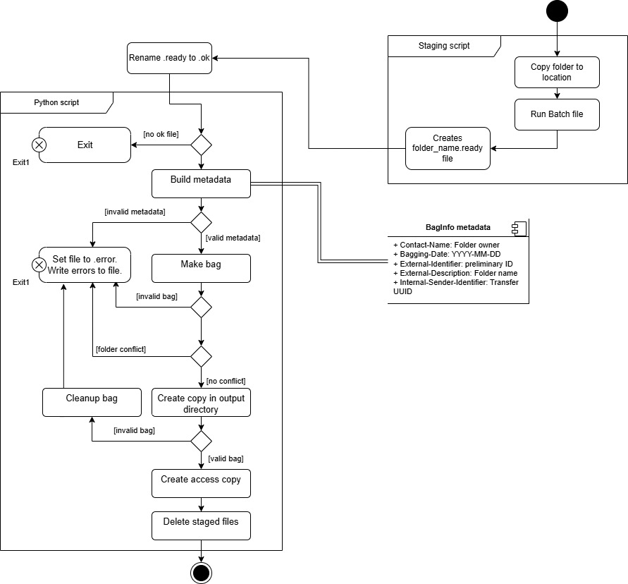
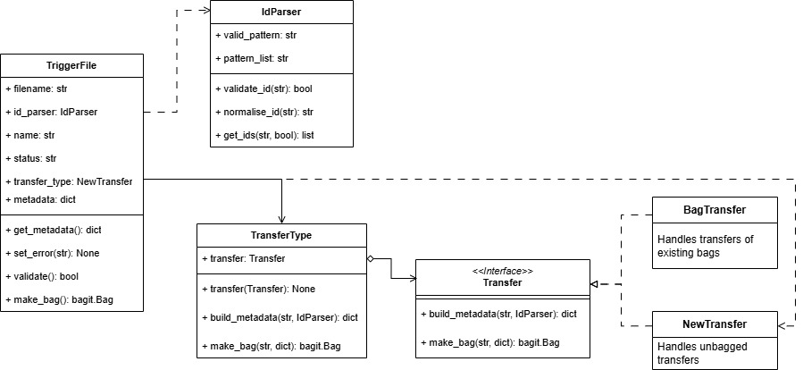
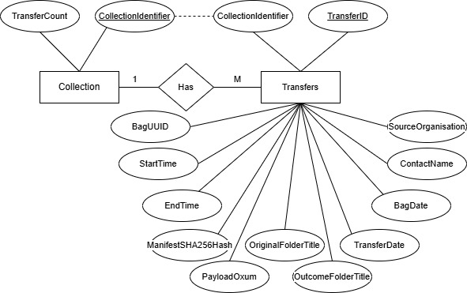
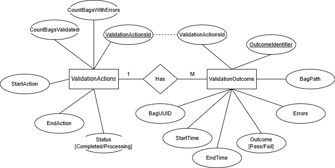

# Bagit Workflow

## Overview

This is a basic workflow for archiving data as BagIt bags. The process is intended to support secure storage by creating copies in a remote location, while ensuring validation and minimum metadata. The process includes a sqlite3 database used to store a record of transfers.

## Getting started

### Dependencies

- [bagit](https://github.com/LibraryOfCongress/bagit-python)
- [Pytest](https://docs.pytest.org/en/stable/)
- [pandas](https://pandas.pydata.org/) *report generation only*  
- Python 3.11
- Pipenv
- Environment:  
        - Script running on a Linux or Windows server.  
        - Transfer directory in a Windows environment.  

Filepaths for all environment variables should be set in a `.env` file. See `env.example` for the required filepaths.

### Process overview

Limitations: This process is designed to support processing of data compatible with a Windows filesystem. It cannot handle files with multiple filestreams.  
**Warning** if using the script on a Linux server, file creation date metadata will not be preserved. 

#### Configuring identifier parsing

Identifiers can be configured using `src/conf/config.json` using the following layout:

                {
                        "id_parser" : {
                                "sep": "[\\-\\._]?\\s?",
                                "identifier_patterns": [
                                ["(SC","\\d{4,}(?=[_-]|\\s|$))"]
                                ],
                                "validation_patterns":[
                                "SC\\d{4,}",
                                ],
                                "normalisation_tests":[
                                "(SC)\\D?(\\d+)"
                                ],
                                "normalisation_joins":[ 
                                ""
                                ]
                        }
                }

The expected data for each key within `"id_parser"` is as follows:
- `sep` - string regular expression containing characters used to separate id components
- `identifier_patterns` - a list containing either complete regular expressions for each identifier type (which will be joined into an OR expression using `|`) or a list of lists which will be joined using the `sep` pattern before joining into a single OR expression.
- `validation_patterns` - a list containing patterns that will be joined into an OR expression using `|`
- `normalisation_tests` and `normalisation_joins` - are a paired list of group patterns which can be used to change the join behaviour to a set character in the list of `normalisation_joins`

Currently parameterized tests are configured for SLV identifiers and will use `test_config.json` to avoid conflicts.

#### Runner scripts

- `droid_report_check.py` : Converts folders stage with `.ready` file, by validating a DROID report inside. Valid reports are moved to review directory and sets file to `.ok`. Otherwise the file is set to `.error` and the issues recorded.
- `bagit_transfer.py` : Bags data and transfers it to a location. Transfers and collections are recorded in a sqlite3 database.    
- `validate_transfers.py` : Runs validation over every bag in a directory. Each run and each check are recorded in a sqlite3 database. A HTML report is exported at the end.    
- `transfer_report.py` : Generates a HTML report of all transfers in the database.
- `report_all_databases.py` : Dumps the contents of the databases to HTML. This is mostly for debugging and won't scale if the databases get too big. 

### Transfer workflow

#### Staging script

This process is designed to use minimal metadata extracted from the folder metadata or within an existing bag. The current configuration looks for a `folder_title.ok` file to determine which collections to process.

To generate these files, a Windows Batch file can be created to generate a `folder_title.ok` file. 
An optional future enhancement would involve generating a `folder_title.ready` file with minimum metadata fields to allow for more nuanced metadata entry. Once the metadata is updated, the user renames the file to `.ok`.

Example `.bat` script for empty file:

        @echo off
            for /D %%i in (*) do if not exist %%i.ok (
                if not exist %%i.error (
                    if not exist %%i.processing (
                        .> %%i.ready)))

Example `.bat` script with metadata:

        @echo off
        for /D %%i in (*) do if not exist %%i.ok (
            if not exist %%i.error (
                if not exist %%i.processing (
                    set var=%%i
                    call :metadata %var% >%%i.ready)))

        :metadata
        echo {"Source-Organization":"",
        echo "Contact-Name":"",
        echo "External-Description":"%var%",
        echo "External-Identifier": ""}

#### Trigger file handling

Staged transfers are handled based on the file extension, whether they have already been bagged, and whether they meet minimum validation requirements.

Staff staging transfers create a trigger file with a `.ready` file extension. These will not be processed via the bagging workflow until they are converted to `.ok`. This can be done manually or automatically by checking a DROID report within the folder. 

The `TriggerFile` class expects a `.ok` file submitted as a path. It performs basic validation checks:
- Does the folder exist?
- Can metadata be parsed?
- Are all the values set?

Any failing conditions are tracked and the errors written to a `.error` file along with a default metadata form.

A future enhancement could implement minimum metadata fields configured in the `.env` file. This would allow for additional fields to be configured, but ensure that the minimum must be included before processing. 

When a bag is being processed, the trigger file is set to `.processing` to avoid re-triggering an in-process transfer.

It relies on the following classes for added functionality:  
- `IdParser` - extracts identifiers from folder titles.
- `Transfer` - handlers for extracting metadata and making bags between bagged or unbagged transfers.

See the class diagram below for a more comprehensive outline of these classes: 

#### Configured tags and identifiers

The following tags are hard-coded into `src/shared_constants.py`:

                PRIMARY_ID = "External-Identifier" # used to store identifier that matches the Accession Record for the material   
                UUID_ID = "Internal-Sender-Identifier" # used to store a bag-specific unique identifier   
                CONTACT = "Contact-Name" # used to store the name of the staff member creating the bag   
                EXTERNAL_DESCRIPTION = "External-Description" # used to store the original folder title   
                SOURCE_ORGANIZATION = "Source-Organization"  # optional -- for adding a set value to all new transfers   
                BAGGING_DATE = "Bagging-Date" # date of bag processing generated by the script   

#### Copying to output directory

Copying is handled in the runner script (`bagit_transfer.py`) and is platform dependent.  
* Windows: attempts to copy using [robocopy](https://learn.microsoft.com/en-us/windows-server/administration/windows-commands/robocopy) with the flags `/e /z /copy:DAT /dcopy:DAT /v`. This copies subdirectories, including empty, in restartable mode, preserving file and directory data, attributes and time stamps, with verbose logging output. It uses the default retry count of 1,000,000. 
* Linux: attempts to copy using [rsync](https://linux.die.net/man/1/rsync) with the flags `-vrlt`. This sets rsync to operate in verbose mode, recursively copy data within directories, copy symbolic links, and preserve modification times.

If either attempt fails the process will attempt to copy using [`shutil.copytree()`](https://docs.python.org/3.13/library/shutil.html#shutil.copytree).

The archive directory is arranged as follows:

        archive/
        |--[collection-identifier-a]/
        |  |--[t1]/                         # contains a bag
        |  |  |-- data/                     # contains all supplied files
        |  |  |-- bag-info.txt              # contains bag metadata
        |  |  |-- bagit.txt                 # contains bag declaration
        |  |  |-- manifest-sha256.txt       # contains filenames and sha256 checksums for all files in data/
        |  |  |-- tagmanifest-sha256.txt    # contains filenames and sha256 checksums for all metadata and manifest files
        |  |--[t2]/
        |  |--[tn]/
        |--[collection identifier-b]/
        |  |--[t1]/
        ...

A sqlite3 database is used to store a record of collections (folders with the same identifier) and transactions (`t1`, `t1`, ... etc).  
To check for duplicate data transfers, the hash of the SHA256 manifest is checked before moving data and stored in the database.  

### Validation process

Validation is handled by running BagIt over files in the archive directory and writing the results to a Sqlite3 database. This database may have a seperate filepath to the transfers directory, or may create the tables in the same file, depending on configuration. 

The script operates in the following way:
- Generates a list of all collections in the supplied directory.  
- Creates an entry in the ValidationActions table to keep track of the number of successful/unsuccessful transfers.
- Validates each transfer within the directory.  
- Records information in the database.
- Once all directories have been checked, sets the status of the ValidationAction to 'Completed'.

This process should be enhanced to run from data stored in the transfers table, to avoid missing validation actions for transfers that have been moved, renamed or deleted.

### Sqlite3 databases

Transfers are tracked using a `sqlite3` database with the following tables:

- `Collections` for counting number of transfers related to each accession record and incrementing the counter.  
        - Primary key: `CollectionIdentifier` (stores collection preliminary identifier)  
- `Transfers` containing key metadata about each transfer, including:  
        - Primary key: `TransferID` (INT, Incremented count of transfers)  
        - `CollectionIdentifier` - matches the primary key in `Collections`.  
        - `BagUUID` - a UUID for the transfer that will be added into the bag info. In future this could be used to record modification or disposal events for individual bags.
        - `TransferDate` - date transfer occurred.  
        - `BagDate` - date bag created.  
        - `PayloadOxum` - BagIt specific metadata containing `octet_count.file_count`.    
        - `ManifestSHA256Hash` - checksum generated from the bag's tag manifest. Used to dedupe identical transfers with different parent folders.    
        - `StartTime` - time transfer started in the format `YYYY-MM-DD HH:MM:SS`  
        - `EndTime` - time transfer was completedin the format `YYYY-MM-DD HH:MM:SS`  
        - `OriginalFolderTitle` - folder name used for the submission (also stored in bag metadata)  
        - `OutecomeFolderTile` - final location of the folder in the archive directory  
        - `ContactName` - the name of the user submitting the bag (not to be confused with the source of the material being bagged), parsed from folder ownership metadata and stored in bag metadata, otherwise "Not recorded"  
        - `SourceOrganisation` - if included stores the `Source-Organization` from the bag metadata, otherwise "Not recorded"  

**Entity Relationship Diagram**

Integrity checks are tracked using a separate database with the following tables:
- `ValidationActions` contains a record for every time the script is run, with a count of successful and unsuccessful validation checks.
        - Primary key: `ValidationActionId` (INT, incremented count of validation actions)    
        - `CountBagsValidated` INT - increments for each successfully validated bag.  
        - `CountBagsWithErrors` INT  - increments for each bag which failed validation.  
        - `TimeStart` - time validation action was started.  
        - `TimeStop`  - time validation action completed.  
        - `Status` - Completed if entire script completed without errors, Processing if in progress.    
- `ValidationOutcome` contains a record for every bag checked, correlated to the ValidationAction  
        - Primary key: `OutcomeIdentifier` (INT, incremented count of validation outcomes)    
        - `ValidationActionId` - correlation id to the ValidationActions table.   
        - `BagUUID`- UUID from the Bag metadata for the bag checked.   
        - `Outcome`- Pass or Fail.    
        - `Errors`- Error message for the failing exception.   
        - `BagPath` - Location of the bag being checked.    
        - `StartTime`- Time that processing commenced.  
        - `EndTime` - Time processing finished.

**Entity Relationship Diagram**   

### Testing

Some tests have been created for:
- `helper_functions`  
        - `TriggerFile` class  
        - `IdParser` class  
        - `Transfer` interface for `TransferType` classes to handle bagged vs new transfers  
- `database_functions`  

## Development

To do:
- Improve test coverage
- Improve error handling
- Data validation for db inputs