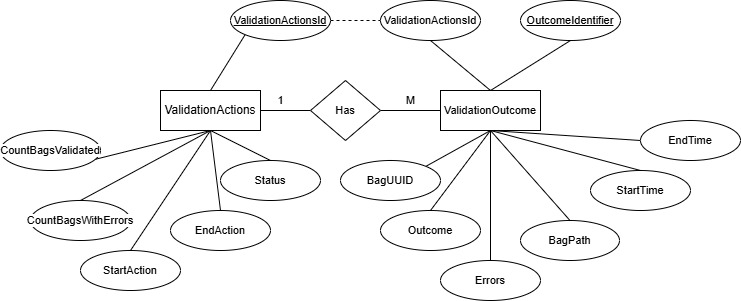

# Bagit Workflow

## Overview

This is a basic workflow for archiving data as BagIt bags. The process is intended to support secure storage by creating copies in a remote location, while ensuring validation and minimum metadata. The process includes a sqlite3 database used to store a record of transfers.

## Getting started

### Dependencies

- [bagit](https://github.com/LibraryOfCongress/bagit-python)
- [Pytest](https://docs.pytest.org/en/stable/)
- [pandas](https://pandas.pydata.org/) *report generation only*  
- Python 3.11
- Environment:  
        - Script running on a Linux server.  
        - Transfer directory in a Windows environment.  

### Process overview

Limitations: This process is designed to support processing of data compatible with a Windows filesystem. It cannot handle files with multiple filestreams. 

#### Runner scripts

- `bagit_transfer.py` : Bags data and transfers it to a location. Transfers and collections are recorded in a sqlite3 database.    
- `validate_transfers.py` : Runs validation over every bag in a directory. Each run and each check are recorded in a sqlite3 database. A html report is exported at the end.
- `report_all_databases.py` : Dumps the contents of the databases to html. This is mostly for debugging and won't scale if the databases get too big. 

### Transfer workflow

#### Staging script

This process is designed to use minimal metadata submitted as JSON or parse metadata from the folder title. The current configuration looks for a `folder_title.ok` file that contains minimum metadata or is a zero byte file. 

To generate these files, a Windows Batch file can be created to generate a `folder_title.ready` file with minimum metadata fields. Once the metadata is updated, the user renames the file to `.ok`.

Example `.bat` script with metadata:

        @echo off
        for /D %%i in (*) do if not exist %%i.ok (
            if not exist %%i.error (
                set var=%%i
                call :metadata %var% >%%i.ready))

        :metadata
        echo {"Source-Organization":"",
        echo "Contact-Name":"",
        echo "External-Description":"%var%",
        echo "External-Identifier": ""}

Example `.bat` script for empty file:

        @echo off
        for /D %%i in (*) do if not exist %%i.ok (
                if not exist %%i.error (
                .> %%i.ok))

#### Trigger file handling

Required metadata fields are configured in the `.env` file. See `env.example` for example fields. Additional fields can be included, but expects at least these.

The `TriggerFile` class expects a `.ok` file submitted as a path. It performs basic validation checks:
- Does the folder exist?
- Can metadata be parsed?
- Does it have the right keys?
- Are all the values set?

Any failing conditions are tracked and the errors written to a `.error` file along with a default metadata form.

When a bag is being processed, the trigger file is set to `.processing` to avoid re-triggering an in-process transfer.

It relies on the following classes for added functionality:  
- `IdParser` - extracts identifiers from folder titles.
- `Transfer` - handlers for extracting metadata and making bags between bagged or unbagged transfers.

See the class diagram below for a more comprehensive outline: 

#### Configured tags and identifiers

The following tags are hard-coded into `src/helper_functions.py`:

                PRIMARY_ID = "External-Identifier"
                UUID_ID = "Internal-Sender-Identifier"
                CONTACT = "Contact-Name"
                EXTERNAL_DESCRIPTION = "External-Description"

#### Copying to output directory

Copying is handled in the runner script (`bagit_transfer.py`) using [rsync](https://linux.die.net/man/1/rsync) with the following flags `-vrlt`.

A sqlite3 database is used to store a record of collections (folders) and transactions (transfers). To check for duplicate data transfers, the hash of the SHA256 manifest is added to the transactions and checked before moving data. 

In the output location, files are stored in the transfer folder they were submitted from, within a subfolder t1 that increments as transfers are added.

### Validation process

Validation is handled by running bagit over files in the archive directory and writing the results to a Sqlite3 database. This database is separate from the transfers database, though theoretically they could be the same. 

The script operates in the following way:
- Generates a list of all collections in the supplied directory.  
- Creates an entry in the ValidationActions table to keep track of the number of successful/unsuccessful transfers.
- Validates each transfer within the directory.  
- Records information in the database.
- Once all directories have been checked, sets the status of the ValidationAction to 'Completed'.

### Sqlite3 databases

Transfers are tracked using a `sqlite3` database with the following tables:

- `Collections` for counting number of transfers and incrementing the counter.  
        - Primary key: `CollectionIdentifier` (stores collection preliminary identifier)  
- `Transfers` containing key metadata about each transfer, including:  
        - Primary key: `TransferID` (Incremented count of transfers)  
        - `CollectionIdentifier` - matches the primary key in `Collections`.  
        - `BagUUID` - a UUID for the transfer that will be added into the bag info.  
        - `TransferDate` - date transfer occurred.  
        - `PayloadOxum` - BagIt specific metadata containing `octet_count.file_count`.  
        - `ManifestSHA256Hash` - checksum generated from the bag's tag manifest. Used to dedupe identical transfers with different parent folders.  
        - `TransferTimeSeconds` - used to track how long transfers take to copy from transfer directory to archive directory.  

**Entity Relationship Diagram**

Integrity checks are tracked using a separate database with the following tables:
- `ValidationActions` contains a record for every time the script is run, with a count of successful and unsucessful validation checks.
        - Primary key: `ValidationActionId` (INT PRIMARY KEY)  
        - `CountBagsValidated` INT  
        - `CountBagsWithErrors` INT  
        - `TimeStart`  
        - `TimeStop`  
        - `Status` Completed if entire script completed without errors, Processing if in progress.  
- `ValidationOutcome` contains a record for every bag checked, correlated to the ValidationAction
        - `OutcomeIdentifier` INTEGER PRIMARY KEY.  
        - `ValidationActionId` Correlation id to the ValiationActions table.   
        - `BagUUID`- UUID from the Bag metadata for the bag checked.   
        - `Outcome`- Pass or Fail.    
        - `Errors`- Error message for the failing exception.   
        - `BagPath` - Location of the bag being checked.    
        - `StartTime`- Time that processing commenced.  
        - `EndTime` - Time processing finished.

**Entity Relationship Diagram**   

### Testing

Some tests have been created for:
- `helper_functions`  
        - `TriggerFile` class  
        - `IdParser` class  
        - `Transfer` interface for `TransferType` classes to handle bagged vs new transfers  
- `database_functions`  
- transfer runner (`bagit_transfer.py`) **need enhancing**  

## Development

To do:
- Improve test coverage
- Improve error handling
- Data validation for db inputs